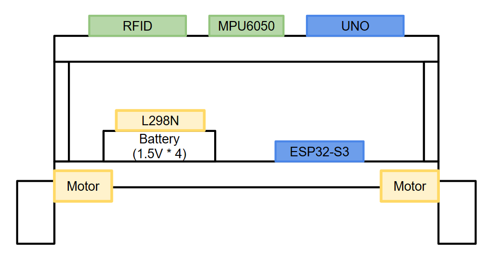

# Self Balancing Robot

## What is Self Balancing Robot
> __Self Balancing Robot__ is a robot that stands on its own like __Segway__.
This Robot requires __PID motor control__ and __Gyro sensor__, and we used __L298N__ and __MPU6050__.

## Used
- MCU   :   Espressif ESP32-S3 N16R8, Arduino Uno
- Gyro Sensor   :   GY-521 (MPU 6050)
- Motors (x2)   :   NP01D-288
- Motor Driver  :   L298N
- Wheels    :   $\phi$ 66mm
- Battery   :   1.5V * 4
- RFID      :   MFRC522

## Body Design


## How To Use
### Installation
1. ```Arduino > Tools > Board > Boards Manager > esp32 (Espressif)```
2. ```Arduino > Tools > Library Manager > MFRC522```

### Pin Settings
- ESP32-S3
```
MPU6050

SCL 1
SDA 2
INTERRUPT   14

--------------------------

L298N

IN1 9
IN2 8
IN4 5
IN3 6
ENA 10  // Right Side Motor
ENB 4  // Left Side Motor
```
- UNO
```
MRFC522

RST_PIN     9     
SS_PIN      10
```

### Program Settings
1. Build ```uno_final/uno_final.ino``` into Arduino Uno
2. Build ```esp32_final/esp32_final.ino``` into ESP32-S3
3. Run ```main.py```


## If you want to PID Controll (Only PID Motor Controll) - ESP32 Nano

### Pin Settings
- ESP32 Nano


### Program Settings
1. Build ```Balanced_Robot/Balanced_Robot.ino``` into ESP32 Nano


## Reference
- [Espressif - ESP32](https://github.com/espressif/arduino-esp32)
- [PyQt5 Docs](https://doc.qt.io/qtforpython-5/PySide2/QtWidgets/index.html)
- [I2CDev - MPU6050](https://github.com/jrowberg/i2cdevlib/tree/master/Arduino/MPU6050)
