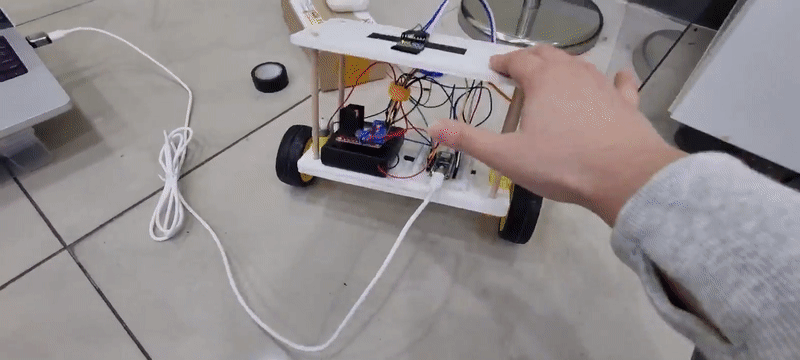
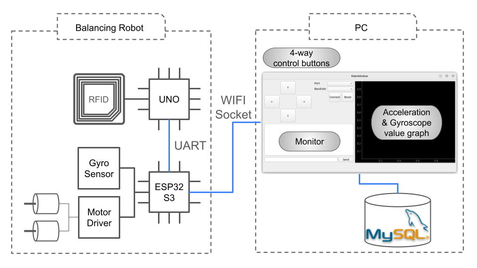
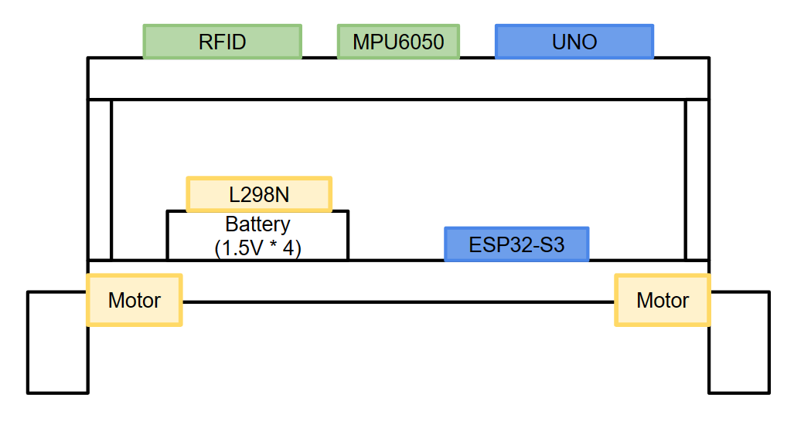

# Self Balancing Robot

    

---

## Index

- [What is Self Balancing Robot](#what-is-self-balancing-robot)
- [Purpose of Project](#purpose-of-project)
- [Showcase](#showcase)
- [Hardware](#hardware)
- [Body Design](#body-design)
- [How To Use](#how-to-use)
    - [Installation](#installation)
    - [Pin Settings](#pin-settings)
    - [Program Settings](#program-settings)
- [If you want to PID Controll (Only PID Motor Controll) - ESP32 Nano](#if-you-want-to-pid-controll-only-pid-motor-controll---esp32-nano)
    - [Pin Settings](#pin-settings-1)
    - [Program Settings](#program-settings-1)
- [SetBack & Improvements & Wrap Up](#setback--improvements--wrap-up)
    - [SetBack](#setback)
    - [Improvements](#improvements)
    - [Wrap Up](#wrap-up)
- [Acknowledgements](#acknowledgements)
---




## What is Self Balancing Robot
> __Self Balancing Robot__ is a robot that stands on its own like __Segway__.
This Robot requires __PID motor control__ and __Gyro sensor__, and we used __L298N__ and __MPU6050__.

---

## Author
|역할|문서영|조홍기|
|---|---|---|
||DC모터 제어|GUI 프로그램 제작|
||하드웨어 설계 및 전장|RFID 모듈 담당|
||MPU6050 센싱|ESP32 WIFI 소켓 통신|
||DB 관련 작업|UNO-ESP32 UART통신|

---

## Purpose of Project
1. Deal with ```Acceleration, Gyroscope``` sensor like ```MPU6050``` and input these values on control process.
2. Study PID and apply it to control Robot.
3. Control the MCU wirelessly.
4. Get familiarized with other MCUs than Arduino UNO

---

## Showcase
1. Wireless Data Communication using __Wifi AP__
2. __PID control__
3. __Access MPU6050 registries__ to get Acceleration and Gyroscope values
4. Sense __RFID__ tags
5. Remote Control using __QT__
6. Log Sensor Data into __MySQL__
---

## Hardware
- MCU   :   Espressif ESP32-S3 N16R8, Arduino Uno
- Gyro Sensor   :   GY-521 (MPU 6050)
- Motors (x2)   :   NP01D-288
- Motor Driver  :   L298N
- Wheels    :   $\phi$ 66mm
- Battery   :   1.5V * 4
- RFID      :   MFRC522

---

## Body Design


---

## How To Use
### Installation
1. ```Arduino > Tools > Board > Boards Manager > esp32 (Espressif)```
2. ```Arduino > Tools > Library Manager > MFRC522```

### Pin Settings
- ESP32-S3
```
TX 17, RX 18

--------------------------
MPU6050

SCL 1
SDA 2
INTERRUPT   14

--------------------------
L298N

IN1 9
IN2 8
IN4 5
IN3 6
ENA 10  // Right Side Motor
ENB 4  // Left Side Motor

```
- UNO
```
RX 0
TX 1

--------------------------
MRFC522

RST_PIN     9     
SS_PIN      10
```

### Program Settings
1. Build ```uno_final/uno_final.ino``` into Arduino Uno
2. Build ```esp32_final/esp32_final.ino``` into ESP32-S3  
    2-1. Connect ESP32-S3 with Serial and Press Reset to find out WIFI IP  
    2-2. Open ```main.py``` and fix IP on line 20  
3. Run ```main.py```

---

## If you want to PID Controll (Only PID Motor Controll) - ESP32 Nano

### Pin Settings
- ESP32 Nano


### Program Settings
1. Build ```Balanced_Robot/Balanced_Robot.ino``` into ESP32 Nano

---

## SetBacks & Wrap Up

### Project SetBacks 
1. Compatibility of hardware configuration with the planned function implementations was not throughly checked in advanced.  
2. Some libraries used during the test period were only available to Arduino Nano ESP32, and not to Esspressif ESP32-S3, causing code integration failures.
3. Unsolved packet loss due to inadequate background knowledge in socket programming.
4. Heuristic (trial-and-error) method for PID control was not efficient considering the given amount of time for this project.
5. Inept soldering skills.

### Wrap Up
1. Controlling motors by tuning PID requires depth knowledge in many fields as dynamics of the system and difference in tuning methods.
2. It would be remarkable to be able to design model which can be expressed in mathematical equations such can lead to model-based tuning to control PID instead of guess and check method.
3. Reading and analyzing hardware specifications to pick fit material for the projects.
4. Every pin should be soldered in place.
5. 여러 통신 기술에 대해 얇고 넓게 알게됨
6. MCU와의 통신에서 어떤 공부를 해야할지 감이 옴.
7. ESP32-S3와 같은 생소한 MCU를 다룰 때 제품 설명서를 어떻게 읽고 사용해야할지 조금 이해함.

---

## To Do
1. Integrate Code.
2. MPU6050 Monitoring Graph.
3. GUI KeyLogger.
4. Develop specific application of this robot. 
5. Improve Socket Communication 

---

## Acknowledgements
- [Espressif - ESP32](https://github.com/espressif/arduino-esp32)
- [PyQt5 Docs](https://doc.qt.io/qtforpython-5/PySide2/QtWidgets/index.html)
- [I2CDev - MPU6050](https://github.com/jrowberg/i2cdevlib/tree/master/Arduino/MPU6050)
